````md
# AI Employee Force

Enterprise AI workforce platform built as a **multi-repo GitHub organization** so multiple teams can independently build, release, and scale platform modules and AI employees.

---

## Vision

AI Employee Force is designed as a platform where:

- the **platform layer** provides the shared product surfaces
- the **agent layer** provides individual AI employees
- the **shared layer** provides reusable contracts, SDKs, UI, and assets
- the **infra layer** powers CI/CD, deployment, and operations
- the **governance layer** keeps architecture, standards, docs, and prompts aligned

This structure allows us to scale to many agents, many teams, and many release cycles without turning the codebase into a bottleneck.

---

## Why this organization exists

This organization is intentionally designed to support:

- independent team ownership
- one repo per major agent
- manifest-driven integration
- centralized shared contracts and UI
- enterprise-grade governance
- safer CI/CD and release management
- scalable growth to 20+ agents

We are **not** using one giant monorepo.  
We are using a **multi-repo GitHub organization model**.

---

## Core principles

1. **One repo per major platform module**
2. **One repo per major AI employee**
3. **Shared logic must be centralized**
4. **Platform must not hardcode agent internals**
5. **Agent discovery must be manifest-driven**
6. **Every repo must have a clear owner**
7. **Infrastructure must stay separate from product code**
8. **Architecture and standards must be documented**
9. **Teams should release independently**
10. **No circular dependencies across repos**

---

# Organization structure

```text
ai-employee-force/
├─ platform/
│  ├─ aief-shell
│  ├─ aief-marketplace
│  ├─ aief-control-center
│  ├─ aief-admin-console
│  └─ aief-identity
│
├─ agents/
│  ├─ aief-fronto
│  ├─ aief-backo
│  ├─ aief-designo
│  ├─ aief-devopsy
│  ├─ aief-testo
│  ├─ aief-automo
│  └─ aief-stacko
│
├─ shared/
│  ├─ aief-ui-kit
│  ├─ aief-agent-sdk
│  ├─ aief-types
│  ├─ aief-auth-sdk
│  ├─ aief-workflow-sdk
│  ├─ aief-design-tokens
│  ├─ aief-icons
│  └─ aief-bot-assets
│
├─ infra/
│  ├─ aief-infra
│  └─ aief-github-actions
│
└─ governance/
   ├─ aief-docs
   ├─ aief-architecture
   ├─ aief-standards
   └─ aief-prompts
````

> This tree is a **logical repo map**, not a monorepo folder structure.

---

# Repository groups

## 1. Platform repos

Platform repos define the core product surfaces users interact with.

### `aief-shell`

Main shell application that hosts:

* navigation
* layout
* workspace container
* routing
* manifest discovery
* shell-level user experience

### `aief-marketplace`

Agent discovery and activation surface:

* browse agents
* search/filter agents
* capability listing
* activation/hire/install flows
* pricing and visibility

### `aief-control-center`

Operational dashboard for:

* task run monitoring
* execution history
* activity insights
* logs
* retry/failure tracking
* usage analytics

### `aief-admin-console`

Enterprise administration surface:

* org settings
* feature flags
* policies
* tenant controls
* governance controls
* admin-level operations

### `aief-identity`

Identity and access layer:

* login/session
* users
* roles
* teams
* permissions
* SSO
* RBAC
* auth integration

---

## 2. Agent repos

Each major AI employee gets its own repository.

### `aief-fronto`

Frontend Developer AI Employee

### `aief-backo`

Backend Developer AI Employee

### `aief-designo`

UI/UX Designer AI Employee

### `aief-devopsy`

DevOps Engineer AI Employee

### `aief-testo`

QA / Testing AI Employee

### `aief-automo`

Automation Engineer AI Employee

### `aief-stacko`

Full Stack Developer AI Employee

Each agent repo may contain:

* manifest
* capabilities
* prompts
* workflows
* agent-specific assets
* evaluation rules
* task-specific UI
* docs and examples

---

## 3. Shared repos

Shared repos contain reusable building blocks used across platform and agent repos.

### `aief-ui-kit`

Shared Angular UI component library

### `aief-agent-sdk`

Shared runtime SDK for agent lifecycle, manifest helpers, validation, telemetry, and orchestration support

### `aief-types`

Pure TypeScript shared contracts and interfaces

### `aief-auth-sdk`

Shared auth helpers, guards, interceptors, session helpers, and permission abstractions

### `aief-workflow-sdk`

Shared workflow and execution abstractions

### `aief-design-tokens`

Design system tokens:

* colors
* typography
* spacing
* shadows
* animation values

### `aief-icons`

Shared icon system

### `aief-bot-assets`

Shared bot SVGs, animation metadata, previews, and asset packs

---

## 4. Infra repos

### `aief-infra`

Infrastructure, deployment, environment templates, scripts, and operational setup

### `aief-github-actions`

Reusable GitHub Actions workflows and shared CI/CD automation

---

## 5. Governance repos

### `aief-docs`

Central documentation hub

### `aief-architecture`

Architecture decisions, RFCs, ADRs, system diagrams, repo boundaries, integration strategy

### `aief-standards`

Engineering rules:

* naming conventions
* PR rules
* dependency rules
* review rules
* code conventions
* release policy

### `aief-prompts`

AI development prompts:

* Cursor prompts
* Claude prompts
* audit prompts
* scaffold prompts
* refactor prompts

---

# Why multi-repo instead of monorepo

We are intentionally using a **multi-repo strategy** because this product needs:

* isolated ownership
* independent releases
* permission boundaries
* lower CI noise
* clearer architecture boundaries
* easier scaling for many agents
* cleaner shared package versioning

A monorepo would create:

* release coupling
* team interference
* slower pipelines
* unclear repo boundaries
* unnecessary coordination for unrelated changes

---

# Repo interaction diagram

```mermaid
flowchart TD
    subgraph Governance
        DOCS[aief-docs]
        ARCH[aief-architecture]
        STD[aief-standards]
        PROMPTS[aief-prompts]
    end

    subgraph Infra
        INFRA[aief-infra]
        GHA[aief-github-actions]
    end

    subgraph Shared
        TYPES[aief-types]
        AGENTSDK[aief-agent-sdk]
        AUTHSDK[aief-auth-sdk]
        WORKFLOWSDK[aief-workflow-sdk]
        UIKIT[aief-ui-kit]
        TOKENS[aief-design-tokens]
        ICONS[aief-icons]
        BOTS[aief-bot-assets]
    end

    subgraph Platform
        SHELL[aief-shell]
        MARKET[aief-marketplace]
        CONTROL[aief-control-center]
        ADMIN[aief-admin-console]
        IDENTITY[aief-identity]
    end

    subgraph Agents
        FRONTO[aief-fronto]
        BACKO[aief-backo]
        DESIGNO[aief-designo]
        DEVOPSY[aief-devopsy]
        TESTO[aief-testo]
        AUTOMO[aief-automo]
        STACKO[aief-stacko]
    end

    TOKENS --> UIKIT
    ICONS --> UIKIT
    TYPES --> AGENTSDK
    TYPES --> AUTHSDK
    TYPES --> WORKFLOWSDK

    TYPES --> SHELL
    TYPES --> MARKET
    TYPES --> CONTROL
    TYPES --> ADMIN
    TYPES --> IDENTITY

    AGENTSDK --> SHELL
    AGENTSDK --> MARKET
    AGENTSDK --> CONTROL

    AUTHSDK --> SHELL
    AUTHSDK --> ADMIN
    AUTHSDK --> IDENTITY

    WORKFLOWSDK --> CONTROL

    UIKIT --> SHELL
    UIKIT --> MARKET
    UIKIT --> CONTROL
    UIKIT --> ADMIN

    BOTS --> FRONTO
    BOTS --> BACKO
    BOTS --> DESIGNO
    BOTS --> DEVOPSY
    BOTS --> TESTO
    BOTS --> AUTOMO
    BOTS --> STACKO

    TYPES --> FRONTO
    TYPES --> BACKO
    TYPES --> DESIGNO
    TYPES --> DEVOPSY
    TYPES --> TESTO
    TYPES --> AUTOMO
    TYPES --> STACKO

    AGENTSDK --> FRONTO
    AGENTSDK --> BACKO
    AGENTSDK --> DESIGNO
    AGENTSDK --> DEVOPSY
    AGENTSDK --> TESTO
    AGENTSDK --> AUTOMO
    AGENTSDK --> STACKO

    UIKIT --> FRONTO
    UIKIT --> BACKO
    UIKIT --> DESIGNO
    UIKIT --> DEVOPSY
    UIKIT --> TESTO
    UIKIT --> AUTOMO
    UIKIT --> STACKO

    DOCS -. references .-> SHELL
    DOCS -. references .-> FRONTO
    DOCS -. references .-> BACKO
    DOCS -. references .-> DESIGNO
    ARCH -. governs .-> SHELL
    ARCH -. governs .-> MARKET
    ARCH -. governs .-> CONTROL
    ARCH -. governs .-> FRONTO
    ARCH -. governs .-> BACKO
    ARCH -. governs .-> DESIGNO
    STD -. enforces .-> SHELL
    STD -. enforces .-> FRONTO
    STD -. enforces .-> BACKO
    STD -. enforces .-> DESIGNO
    GHA -. reusable workflows .-> SHELL
    GHA -. reusable workflows .-> FRONTO
    GHA -. reusable workflows .-> BACKO
    GHA -. reusable workflows .-> DESIGNO
    INFRA -. deployment and envs .-> SHELL
    INFRA -. deployment and envs .-> MARKET
    INFRA -. deployment and envs .-> CONTROL
    INFRA -. deployment and envs .-> ADMIN
```



---

# Dependency map

## Allowed dependency direction

```text
governance  -> references all, governs all
infra       -> supports all
shared      -> can be used by platform and agents
platform    -> can depend on shared
agents      -> can depend on shared
platform    -> may consume agent manifests
agents      -> must NOT depend on platform internals
shared      -> must NOT depend on platform repos
shared      -> must NOT depend on agent repos
agent repos -> must NOT depend on other agent repos directly unless explicitly approved
```

## Dependency rules matrix

| From \ To  |                     Platform |                                Agents |                        Shared |                Infra | Governance |
| ---------- | ---------------------------: | ------------------------------------: | ----------------------------: | -------------------: | ---------: |
| Platform   |                      Limited |                 Manifest-only / loose |                           Yes | Via pipelines/config |        Yes |
| Agents     | No direct platform internals | Avoid direct cross-agent dependencies |                           Yes | Via pipelines/config |        Yes |
| Shared     |                           No |                                    No | Limited, carefully controlled |                   No |        Yes |
| Infra      |                 Supports all |                          Supports all |                  Supports all |                  Yes |        Yes |
| Governance |                  Governs all |                           Governs all |                   Governs all |          Governs all |        Yes |

## Key rules

### Platform repos

Can depend on:

* `aief-types`
* `aief-agent-sdk`
* `aief-ui-kit`
* `aief-auth-sdk`
* `aief-workflow-sdk`
* `aief-design-tokens`
* `aief-icons`

Must not:

* embed agent-specific private business logic
* tightly couple to one specific agent implementation
* duplicate shared contracts

### Agent repos

Can depend on:

* `aief-types`
* `aief-agent-sdk`
* `aief-ui-kit`
* `aief-design-tokens`
* `aief-icons`
* `aief-bot-assets`
* `aief-workflow-sdk` where relevant

Must not:

* depend directly on platform application internals
* duplicate shared types or runtime lifecycle logic
* tightly couple to another agent repo

### Shared repos

Can depend on:

* other shared repos only when justified and documented

Must not:

* depend on platform repos
* depend on agent repos

---

# Manifest-driven integration

A core principle of this organization is **manifest-driven agent integration**.

Agents should publish metadata like:

```json
{
  "id": "fronto",
  "slug": "fronto",
  "name": "Fronto",
  "title": "Frontend Developer",
  "version": "1.0.0",
  "category": "engineering",
  "description": "Builds clean, responsive, production-ready interfaces.",
  "ownerTeam": "agent-fronto-team",
  "status": "active",
  "capabilities": [
    "component-generation",
    "responsive-fix",
    "accessibility-audit"
  ],
  "entry": "/agents/fronto",
  "visibility": "public",
  "pricingTier": "pro"
}
```

This allows:

* `aief-shell` to discover agents without hardcoding them
* `aief-marketplace` to display agent cards from manifests
* `aief-control-center` to reason about agent metadata
* `aief-admin-console` to control availability and visibility

---

# What each repo should own

## Platform repos own

* app surfaces
* page routing
* product-level flows
* system dashboards
* shell layout
* admin flows
* org-level interactions

## Agent repos own

* agent-specific capability definitions
* prompts
* workflows
* manifests
* agent assets and content
* examples
* evaluation rules

## Shared repos own

* UI consistency
* runtime contracts
* common interfaces
* theme system
* icons
* bot assets
* reusable libraries

## Infra repos own

* deployment setup
* environment patterns
* CI/CD templates
* quality gates
* release automation

## Governance repos own

* architecture decisions
* standards
* docs
* prompt assets
* organizational engineering guidance

---

# Team ownership model

Every repo must have a clear owner team and CODEOWNERS coverage.

## Team ownership table

| Team                     | Primary responsibility                                | Owns repos                                                           | Reviews repos                                                 |
| ------------------------ | ----------------------------------------------------- | -------------------------------------------------------------------- | ------------------------------------------------------------- |
| `platform-core`          | Shell, platform composition, core architecture        | `aief-shell`                                                         | `aief-marketplace`, `aief-control-center`                     |
| `platform-ui`            | Product surfaces and UX flows                         | `aief-marketplace`, `aief-control-center`, `aief-admin-console`      | `aief-shell`, `aief-ui-kit`                                   |
| `platform-auth`          | Identity, auth, roles, permissions                    | `aief-identity`, `aief-auth-sdk`                                     | `aief-shell`, `aief-admin-console`                            |
| `platform-agent-runtime` | Agent runtime contracts and orchestration foundations | `aief-agent-sdk`, `aief-workflow-sdk`                                | all agent repos, `aief-shell`, `aief-control-center`          |
| `agent-fronto-team`      | Frontend Developer AI Employee                        | `aief-fronto`                                                        | manifest-related changes touching Fronto                      |
| `agent-backo-team`       | Backend Developer AI Employee                         | `aief-backo`                                                         | manifest-related changes touching Backo                       |
| `agent-designo-team`     | UI/UX Designer AI Employee                            | `aief-designo`                                                       | manifest-related changes touching Designo                     |
| `agent-devopsy-team`     | DevOps Engineer AI Employee                           | `aief-devopsy`                                                       | infra-related agent integrations                              |
| `agent-testo-team`       | QA / Testing AI Employee                              | `aief-testo`                                                         | testing and quality flow integrations                         |
| `agent-automo-team`      | Automation Engineer AI Employee                       | `aief-automo`                                                        | automation flow integrations                                  |
| `agent-stacko-team`      | Full Stack Developer AI Employee                      | `aief-stacko`                                                        | cross-layer engineering flows                                 |
| `design-system-team`     | Shared design system and visual consistency           | `aief-ui-kit`, `aief-design-tokens`, `aief-icons`, `aief-bot-assets` | all UI-heavy repos                                            |
| `devops-team`            | CI/CD, infra, envs, deployment                        | `aief-infra`, `aief-github-actions`                                  | all production-impacting repos                                |
| `security-team`          | Security policy, secrets, review gates                | no single app repo necessarily                                       | `aief-identity`, `aief-auth-sdk`, `aief-admin-console`, infra |
| `qa-team`                | Quality strategy and verification                     | testing standards across org                                         | all major release repos                                       |
| `architecture-team`      | Architecture decisions and repo governance            | `aief-architecture`, `aief-standards`                                | all foundational repos                                        |
| `docs-team`              | Documentation, onboarding, internal/external docs     | `aief-docs`                                                          | all docs-heavy changes                                        |
| `ai-enablement-team`     | Prompt systems and AI-assisted development assets     | `aief-prompts`                                                       | agent prompt frameworks and audit prompt assets               |

---

# Suggested CODEOWNERS strategy

Example:

```text
* @ai-employee-force/platform-core
/docs/ @ai-employee-force/docs-team
/.github/ @ai-employee-force/devops-team
/src/lib/contracts/ @ai-employee-force/platform-agent-runtime
```

Agent repo example:

```text
* @ai-employee-force/agent-fronto-team
/docs/ @ai-employee-force/docs-team
/manifest/ @ai-employee-force/platform-agent-runtime @ai-employee-force/architecture-team
/.github/ @ai-employee-force/devops-team
```

---

# Release and ownership philosophy

## Independent releases

Each major repo should be able to release independently.

Examples:

* Fronto can ship new capabilities without blocking Shell
* UI Kit can version new components without forcing immediate platform deployment
* Bot assets can evolve without editing application logic

## Shared version discipline

Shared packages should follow semantic versioning and publish clean changelogs.

## Clear approval boundaries

* app repos: owning team + platform review when needed
* shared repos: owning shared team + architecture/runtime review
* auth and infra repos: stricter security review

---

# What must never be duplicated

The following should stay centralized:

* shared TypeScript contracts → `aief-types`
* agent runtime helpers → `aief-agent-sdk`
* auth/session utilities → `aief-auth-sdk`
* workflow abstractions → `aief-workflow-sdk`
* reusable UI components → `aief-ui-kit`
* design tokens → `aief-design-tokens`
* icons → `aief-icons`
* bot visuals → `aief-bot-assets`
* engineering rules → `aief-standards`
* architecture decisions → `aief-architecture`

---

# What must never happen

1. Shell becoming a dumping ground for all agent logic
2. Every repo inventing its own types
3. Every team building its own UI system
4. Shared repos depending on app repos
5. Agent repos tightly depending on platform internals
6. Hardcoded agent registration everywhere
7. Unowned repos with no CODEOWNERS
8. Infra scripts duplicated in random repos
9. Architecture decisions living only in chat history
10. Prompts and AI development assets scattered across personal notes

---

# Recommended Phase 1 repos

Start with these first:

* `aief-shell`
* `aief-fronto`
* `aief-backo`
* `aief-designo`
* `aief-ui-kit`
* `aief-agent-sdk`
* `aief-types`
* `aief-bot-assets`
* `aief-infra`
* `aief-docs`
* `aief-architecture`

Why:

* enough to build a real platform host
* enough to build 3 real agents
* enough to enforce shared contracts and UI
* enough to set architecture and infra discipline early

Later add:

* `aief-marketplace`
* `aief-control-center`
* `aief-admin-console`
* `aief-identity`
* `aief-auth-sdk`
* `aief-workflow-sdk`
* `aief-icons`
* `aief-standards`
* `aief-prompts`
* more agents

---

# Governance expectations

Every repo should include, where applicable:

* `README.md`
* `CODEOWNERS`
* `.github/pull_request_template.md`
* issue templates
* `CONTRIBUTING.md`
* `SECURITY.md`
* `CHANGELOG.md`
* CI workflow
* clear ownership
* release expectations
* dependency rules

---

# Standards we enforce across the organization

* branch protection on `main`
* required PR reviews
* CODEOWNERS review for protected paths
* lint/test/build checks
* semantic versioning for publishable packages
* documented dependency boundaries
* secret scanning
* environment separation
* reproducible CI/CD workflows
* architecture review for foundational changes

---

# Mental model

Think of the organization like this:

* **Platform** = the operating surfaces
* **Agents** = the AI employees
* **Shared** = the reusable foundation
* **Infra** = the machinery that runs everything
* **Governance** = the rules, architecture, and documentation that keep the whole system healthy

---

# Long-term outcome

This structure gives AI Employee Force the ability to become:

* an enterprise platform
* a scalable multi-agent product
* a multi-team engineering organization
* a cleanly governed code ecosystem
* a product with reusable internal standards and assets
* a system that can grow from 3 agents to 30+ without collapsing into chaos

---

# Summary

AI Employee Force is organized as a **multi-repo GitHub organization** because the product requires:

* multiple platform surfaces
* many independently evolving AI employees
* centralized shared libraries
* disciplined infra and CI/CD
* documented architecture and standards

This model lets us move fast **without losing structure**.

---
